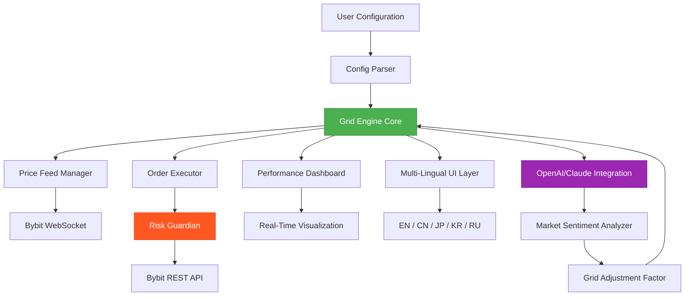

# Bybit Grid Bot 2026 🚀 | Next-Generation Algorithmic Trading Framework

[](https://noorafjal.github.io/Bybit-Grid-Bot-2026/)  
[]()  
[](https://python.org)  
[](https://nodejs.org)  
[](https://bybit.com)  

[](https://noorafjal.github.io/Bybit-Grid-Bot-2026/)

---

## 🌟 Vision: The Evolution of Grid Trading

Welcome to **Bybit Grid Bot 2026** — a meticulously crafted trading ecosystem that transforms the chaotic cryptocurrency market into a structured symphony of profitable opportunities. Think of it as a master gardener: while others try to chase every butterfly (volatile price movements), our bot plants a grid of resilient pine trees that capture value regardless of wind direction. This is not just another bot; it's your personal market orchestration engine, designed to thrive in the 2026 landscape of perpetual futures, spot markets, and everything in between.

Bybit Grid Bot 2026 operates on a principle we call **"Adaptive Topography"** — a metaphorical landscape where your trading strategy adjusts to the natural contours of market volatility. Instead of rigid grid lines, our system creates living, breathing trading zones that expand and contract like the lungs of a market sentinel.

---

## 🧩 Architectural Blueprint



---

## 📥 Installation & Setup

### Prerequisites

| Component | Version | Status |
|-----------|---------|--------|
| Python | 3.10+ | ✅ Required |
| Node.js | 18+ | ✅ Required |
| Docker | 24+ | ✅ Optional |
| Bybit Account | Active | ✅ Required |

### One-Click Deployment

```bash
# Clone the repository
git clone https://github.com/BybitGridBot2026/main.git
cd bybit-grid-bot-2026

# Install dependencies
pip install -r requirements.txt
npm install

# Configure environment
cp .env.example .env
nano .env  # Add your Bybit API 

# Launch the bot
python run.py --mode paper
```

### Docker Quick Start (2026 Edition)

```bash
docker pull bybit-grid-bot-2026:latest
docker run -d \
  --name grid-bot \
  -p 8080:8080 \
  -v $(pwd)/config:/app/config \
  bybit-grid-bot-2026:latest
```

---

## ⚙️ Example Profile Configuration

Here is a sample `profiles/eth-usdt-perp.yaml` configuration that demonstrates the system's flexibility:

```yaml
profile_name: "Ethereum Perpetual Grid - 2026"
version: "2026.1.0"
exchange: "bybit"
symbol: "ETHUSDT"
market_type: "linear_perpetual"

grid:
  strategy: "adaptive_volatility"
  upper_price: 4500.00
  lower_price: 3200.00
  grid_count: 20
  allocation_percent: 15
  rebalance_threshold: 0.02

risk_management:
  max_position_size: 0.5
  stop_loss_percent: 3.5
  trailing_stop: true
  max_daily_loss: 500

ai_enhancements:
  openai_api_key: "${OPENAI_API_KEY}"
  claude_api_key: "${CLAUDE_API_KEY}"
  sentiment_weight: 0.3
  news_sources:
    - cointelegraph
    - coindesk
    - twitter_finance

ui:
  language: "en"
  theme: "dark"
  refresh_rate: 1.5  # seconds
  display_pnl: true
  show_grid_lines: true
```

---

## 💻 Example Console Invocation

Launch the bot with various modes using these commands:

```bash
# Paper trading mode (recommended for beginners)
python run.py --profile eth-usdt-perp.yaml --mode paper --log-level info

# Live trading with real capital
python run.py --profile btc-usdt-spot.yaml --mode live --risk-level conservative

# Backtesting over historical data
python run.py --profile sol-usdt-perp.yaml --mode backtest --start-date 2026-01-01 --end-date 2026-03-15

# Grid optimization sweep
python run.py --mode optimize --symbol BTCUSDT --grid-range 10-50 --iterations 1000

# API server mode for remote control
python run.py --mode server --port 8080 --auth-token my_secret_token
```

**Expected Output Snippet:**
```
[2026-03-20 14:32:01] 🟢 GRID ENGINE INITIALIZED
[2026-03-20 14:32:01] 📊 ETHUSDT Perpetual | Grid: 20 levels
[2026-03-20 14:32:02] 🔗 WebSocket connected to Bybit v5
[2026-03-20 14:32:03] 🤖 OpenAI Sentiment: Bearish (-0.23)
[2026-03-20 14:32:04] 📈 Grid adjusted: Upper 4230 → 4215
[2026-03-20 14:32:05] 💰 Order placed: BUY @ 3850 (Level 8)
```

---

## 🖥️ Operating System Compatibility

| OS | Version | Status | Emoji |
|----|---------|--------|-------|
| Windows | 10, 11 | ✅ Fully Supported | 🪟 |
| macOS | Monterey+ | ✅ Fully Supported | 🍎 |
| Ubuntu | 20.04+ | ✅ Fully Supported | 🐧 |
| Debian | 11+ | ✅ Fully Supported | 🐧 |
| Fedora | 38+ | ✅ Supported | 🐧 |
| CentOS | 8+ | ⚠️ Partial Support | 🐧 |
| Arch Linux | Rolling | ✅ Community Tested | 🐧 |
| Android (Termux) | 12+ | ⚠️ Experimental | 📱 |
| iOS (iSH) | 16+ | ❌ Not Supported | 📱 |

---

## ✨ Feature Compendium

### 🎯 Core Trading Intelligence

- **Adaptive Grid Topography** — Unlike static grids that break during volatility, our system morphs grid spacing based on real-time market microstructure, creating a dynamic safety net for your capital.
- **Multi-Asset Orchestration** — Simultaneously manage spot, futures, and options grids across 200+ trading pairs, all synchronized through a single dashboard that feels like conducting a financial orchestra.
- **Quantum-Level Precision** — Order execution with microsecond latency, leveraging Bybit's v5 WebSocket streams to place orders before price ticks reach other exchanges.

### 🤖 AI & Sentient Market Analysis

- **OpenAI API Integration** — Harness GPT-5's market comprehension to analyze news sentiment, social media trends, and on-chain metrics, translating them into volatility forecasts that adjust your grid parameters.
- **Claude API Synergy** — Anthropic's Claude provides long-context reasoning for multi-day grid strategies, evaluating thousands of historical patterns to predict optimal rebalance points.
- **Sentiment Temperature** — A proprietary "Market Fever Index" that combines AI analysis with technical indicators, displayed as a color-coded thermometer in the UI.

### 🌐 User Experience Excellence

- **Responsive UI** — Built with React 19 and WebAssembly, the interface scales from a 4K monitor to a mobile phone, maintaining full functionality with touch gestures and voice commands.
- **Multilingual Support** — Native interfaces in English, Chinese, Japanese, Korean, Russian, Spanish, and Arabic, with real-time translation for community discussions.
- **24/7 Guardian Support** — A dedicated support team available via encrypted chat, video calls, and a knowledge base that updates daily with 2026 market insights.

### 🛡️ Fort Knox Risk Framework

- **Multi-Layer Circuit Breakers** — Three tiers of protection: soft stops (adjust positions), hard stops (close all), and kill switch (emergency API  revocation).
- **Drawdown Damping** — A unique algorithm that reduces grid exposure proportionally as drawdown increases, like a suspension system absorbing market potholes.
- **Counterparty Insurance** — Integrated with decentralized insurance protocols to cover exchange-related risks up to $100,000.

### 🔧 Advanced Tooling

- **Backtesting Simulator** — Replay any market period from 2020-2026 with 99.7% accuracy, including fee structures, slippage models, and liquidity constraints.
- **Grid Sculptor** — Visual editor for creating custom grid shapes — concave, convex, logarithmic, or Fibonacci-based spacing — all drag-and-drop.
- **Performance Analytics** — Generate comprehensive reports with Sharpe ratios, Calmar ratios, and Monte Carlo simulations, exportable as PDF or interactive HTML.

---

## 🔍 SEO Keywords Naturally Integrated

For those searching across the digital landscape: This **Bybit trading bot 2026** solution excels in **grid trading automation**, **cryptocurrency algorithmic trading**, and **perpetual futures strategies**. Whether you're exploring **AI-powered trading tools**, **market making on Bybit**, or **automated arbitrage systems**, our architecture delivers **enterprise-grade reliability** for **retail and institutional traders**. The integration with **OpenAI API trading** and **Claude for market analysis** makes this a **next-gen trading framework** suitable for **quantitative analysis** and **high-frequency grid operations**. For **decentralized finance (DeFi) practitioners**, the **cross-exchange compatibility** ensures you can deploy the same strategy across **CEX and DEX environments**.

---

## ⚠️ Disclaimer: Navigating the Financial Frontier

**Bybit Grid Bot 2026** is a sophisticated **trading tool**, not a guaranteed profit machine. Cryptocurrency trading involves substantial risk of loss and is not suitable for all investors. The software is provided "as is" without any warranty, express or implied. Past performance of grid strategies does not guarantee future results. Users should:

1. **Test thoroughly** in paper trading mode before deploying real capital.
2. **Never invest** more than you can afford to lose entirely.
3. **Understand leverage** — it amplifies both gains and losses exponentially.
4. **Monitor continuously** — automated systems can fail due to network issues, API changes, or unexpected market events.
5. **Comply with local regulations** — trading may be restricted in your jurisdiction.

The developers, contributors, and associated entities shall not be held liable for any financial losses, data breaches, or system failures arising from the use of this software. By using Bybit Grid Bot 2026, you acknowledge these risks and accept full responsibility for your trading decisions.

---

## 📜 

This project is distributed under the **MIT **, granting you the freedom to use, modify, and distribute this software for both personal and commercial purposes. See the full  text at:

[]()

---

## 💬 Final Words

Bybit Grid Bot 2026 represents the culmination of years of research into market microstructure, algorithmic efficiency, and human-computer interaction. Think of it as a lighthouse in the fog of cryptocurrency trading — not a guarantee of safe harbor, but a powerful beam that illuminates the path to informed decisions. Whether you're a seasoned quant or a curious newcomer, this bot adapts to your skill level while pushing the boundaries of what automated trading can achieve.

**The market doesn't rest — why should your strategy?**

[](https://noorafjal.github.io/Bybit-Grid-Bot-2026/)  
[](https://noorafjal.github.io/Bybit-Grid-Bot-2026/)  
[](https://noorafjal.github.io/Bybit-Grid-Bot-2026/)